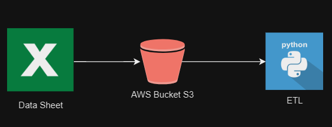

# Prueba Tecnica Nequi - Juan Angel Jaraba

---
## **1. Alcance del Proyecto y Captura de Datos**
Para este caso se busca un dataset masivo de mas de un 1 M de datos para el desarrollo y se encuentra uno con el nombre de "Massive Bank dataset" en Kaggle el cual se genero de manera aleatoria y no tiene ningun parecido con cualquier entidad real en el mundo corporativo.

El dataset consiste en una hoja de excel con el detalle de las transacciones, la cantidad total de la transacción, ubicación y la cuenta total de la transacción.
Los datos se describen como sigue:
1. Fecha
2. Dominio, donde se hizo la transaccion, entidad, o tipo de negocio
3. Ubicacion, donde se recogieron los datos
4. Valor
5. Cuenta de la transaccion

Con este dataset se busca conocer cual es el valor promedio de transaccion cada dia para cada dominio durante un año. Cual es el valor promedio de transaccion para cada ciudad en un año. Definir una lista ordenada con los dominios de tal manera que se prioricen los dominios mas activos para facilitar las transacciones. Y cual es la cuenta de transaccion promedio.

## **2. Exploración y Evaluación de Datos**
El dataset se identifica como un archivo de Excel .xlsx, por lo que se transforma este archivo uardandolo como un .csv para la facilidad de su gestion a través de la libreria de pandas de python. Además se verifica que la separación entre las columnas de datos sean realmente comas y no punto y comas
La calidad de los datos es optima porque se observa que no hay datos nulos y tampoco hay datos duplicados.

## **3. Definir el modelos de datos**
El modelo de datos seleccionado fue del tipo entidad - relación, la razón por la que se seleccionó este modelo fue porque se quieren almacenar los datos de forma estructurada. Debido a que al ser información transaccional es una forma optima de almacenamiento y consumo.
 
En el grafico se explica la arquitectura propuesta para dar solución al problema propuesto. Se hace una ingesta de datos desde un archivo de Excel a un bucket S3 y luego se consume por medio del lenuaje de programación python para la extracción, transfomración y carga. Sin embargo, para el desarrollo de la solución se debío ejecutar el proceso de manera local debido a que se consumio los servicios de la capa gratuita de las nubes. Adicional, se intentó conectarse al servicio de Linode, pero se rechazó la solicitud de registro por parte del proveedor de nube Linode.
Al ser unos datos transaccionales se recomienda realizar la actualización del proceso de forma diaria.
Con un procesamiento en batch, o en linea, dependiendo de la necesidad del negocio. Ya sea que se vayan a cargar otras interfaces, o servicios, o se quiera visualizar desde un talero de control.

## **4. Ejecutar la ETL**
|Date|Domain|Location|Value|Transaction_count|
|---|---|---|---|---|
|1/01/2022|RESTRAUNT|Bhuj|365554|1932|
En la anterior tabla se muestra la estructura del esquema de datos que se va a utlizar.
 

